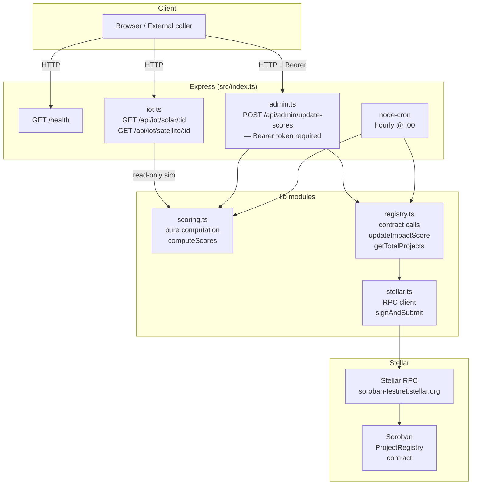

# Heliobond Backend

Node.js oracle server for the Heliobond platform. It simulates IoT sensor data for solar panel and satellite readings, computes impact scores from that data, and submits `update_impact_score` transactions to the Soroban **ProjectRegistry** contract on Stellar. An hourly cron job keeps on-chain scores current automatically; the same logic is exposed over REST for on-demand updates.

---

## Architecture



**Data flow for a score update** (admin route or cron):

1. `getSolarData(id)` and `getSatelliteData(id)` produce deterministic, hourly-seeded sensor readings.
2. `computeScores({ solar, satellite })` derives `credit_quality` and `green_impact` (pure, no I/O).
3. `updateImpactScore(id, cq, gi)` in `registry.ts` builds and prepares a Soroban transaction.
4. `signAndSubmit(xdr, keypair)` in `stellar.ts` signs, submits, and polls until the transaction is confirmed.

---

## API Reference

| Method | Path | Auth | Description |
|--------|------|------|-------------|
| `GET` | `/health` | — | Liveness check |
| `GET` | `/api/iot/solar/:id` | — | Simulated solar panel reading for project `id` |
| `GET` | `/api/iot/satellite/:id` | — | Simulated satellite / vegetation reading for project `id` |
| `POST` | `/api/admin/update-scores` | Bearer token | Submit impact score update(s) to the Soroban contract |

### `GET /health`

```json
{ "status": "ok" }
```

### `GET /api/iot/solar/:id`

```json
{
  "power_output_kw": 742.15,
  "efficiency_pct": 74.21,
  "max_power_kw": 1000,
  "timestamp": 1718150400000
}
```

Readings are deterministic per `(project_id, hour)` — the same id returns the same values within a given clock hour.

### `GET /api/iot/satellite/:id`

```json
{
  "forest_density_pct": 68.44,
  "ndvi_score": 0.684,
  "timestamp": 1718150400000
}
```

### `POST /api/admin/update-scores`

**Headers:** `Authorization: Bearer <ADMIN_API_KEY>`

**Body (optional):**
```json
{ "project_ids": [1, 2, 3] }
```

Omit `project_ids` (or send an empty array) to update every project registered on-chain (fetched via `getTotalProjects()`).

**Response:**
```json
{
  "updated": 2,
  "results": [
    {
      "project_id": 1,
      "tx_hash": "abc123...",
      "credit_quality": 74,
      "green_impact": 69
    }
  ],
  "errors": []
}
```

Soroban does not support multi-call batching; transactions are submitted sequentially.

---

## Score Formula

Both output values are integers in `[0, 100]`.

```
credit_quality = clamp(efficiency_pct, 0, 100)

green_impact   = clamp(
                   (power_output_kw / max_power_kw) * 50
                 + (forest_density_pct / 100)        * 50,
                   0, 100
                 )
```

`credit_quality` reflects how efficiently the solar array is operating.  
`green_impact` is a 50/50 blend of power production ratio and vegetation health.

---

## Environment Variables

Create a `.env` file (see `.env.example`):

| Variable | Required | Default | Description |
|----------|----------|---------|-------------|
| `STELLAR_NETWORK` | No | `testnet` | `testnet` or `mainnet` — selects the network passphrase |
| `ADMIN_SECRET_KEY` | Yes | — | Stellar secret key (`S...`) used to sign transactions |
| `PROJECT_REGISTRY_CONTRACT_ID` | Yes | — | Soroban contract address for the ProjectRegistry |
| `RPC_URL` | No | `https://soroban-testnet.stellar.org` | Stellar RPC endpoint |
| `PORT` | No | `3001` | HTTP port the server listens on |
| `FRONTEND_URL` | No | `http://localhost:3000` | Origin allowed by CORS |
| `ADMIN_API_KEY` | No | — | Bearer token for `/api/admin/*`. If unset, auth is skipped (dev only) |

---

## Getting Started

```bash
# Install dependencies
bun install

# Configure environment
cp .env.example .env
# Edit .env and fill in ADMIN_SECRET_KEY, PROJECT_REGISTRY_CONTRACT_ID, etc.

# Development (ts-node, live reload)
bun run dev

# Production
bun run build && bun start

# Tests (8 tests)
bun test
```

---

## Tech Stack

| Layer | Technology |
|-------|-----------|
| Runtime | Node.js 20 |
| Language | TypeScript |
| HTTP framework | Express 5 |
| Stellar SDK | `@stellar/stellar-sdk` v15 |
| Scheduler | `node-cron` v4 |
| Package manager / test runner | Bun |
| Test framework | Jest + ts-jest + Supertest |
