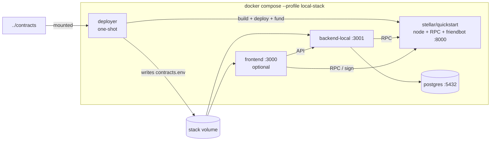

# Local full stack

Run the backend, a local Stellar node, freshly deployed contracts and (optionally)
the frontend with one command, instead of hand-deploying contracts and copying
ids between three `.env` files.

> **Status:** the compose services and deploy script follow the layout described
> below but have not been exercised against the real contracts/frontend repos.
> Expect to adjust the wasm names in `scripts/local-stack/deploy.sh` and the
> frontend build args on first run, and please send fixes back.

## Layout

```
projects/
├── backend/     <- this repo (run compose here)
├── contracts/   <- Heliobond contracts repo   (override: CONTRACTS_DIR)
└── frontend/    <- Heliobond frontend repo    (override: FRONTEND_DIR)
```



## Usage

```bash
# backend + node + contracts + postgres
docker compose --profile local-stack up --build backend-local

# ...plus the frontend
docker compose --profile local-stack --profile local-stack-frontend up --build backend-local frontend
```

Name `backend-local` explicitly: the plain `backend` service has no profile, so a bare
`--profile local-stack up` would also start it and clash on port 3001. The plain
`docker compose up` (no profile) is unchanged: it starts only that `backend`
against whatever your `.env` points at.

Order of events: `stellar` becomes healthy → `deployer` builds and deploys the
contracts, funds `deployer`/`admin` through the local friendbot and writes
`contracts.env` to the shared `stack` volume → `backend-local` sources that file
and starts (migrations run against `postgres`).

Variables: `CONTRACTS_DIR`, `FRONTEND_DIR`, `ADMIN_API_KEY` (default `local-admin-key`).

Reset everything, including chain state and the database:

```bash
docker compose --profile local-stack --profile local-stack-frontend down -v
```

## Troubleshooting

| Symptom | Likely cause / fix |
| --- | --- |
| `deployer` exits with `no such file` for a `.wasm` | Wasm names differ in your contracts repo. Set `REGISTRY_WASM` / `VAULT_WASM` (env on the `deployer` service) or edit `scripts/local-stack/deploy.sh`. |
| `deployer` hangs on "waiting for ..." | Node not ready yet (first start takes ~1 min). Check `docker compose logs stellar`. |
| `backend-local` fails on `/stack/contracts.env` | The deployer failed; run `docker compose --profile local-stack logs deployer`. |
| Contract ids stale after changing contracts | `down -v` to wipe the `stack` volume and chain state, then `up` again. |
| Frontend can't reach the API (CORS) | Backend allows `http://localhost:3000` by default; change `CORS_ORIGIN` on `backend-local` if you serve it elsewhere. |
| Port already in use | Stop the other process on 3001/8000/3000 or remap the ports in `docker-compose.yml`. |
